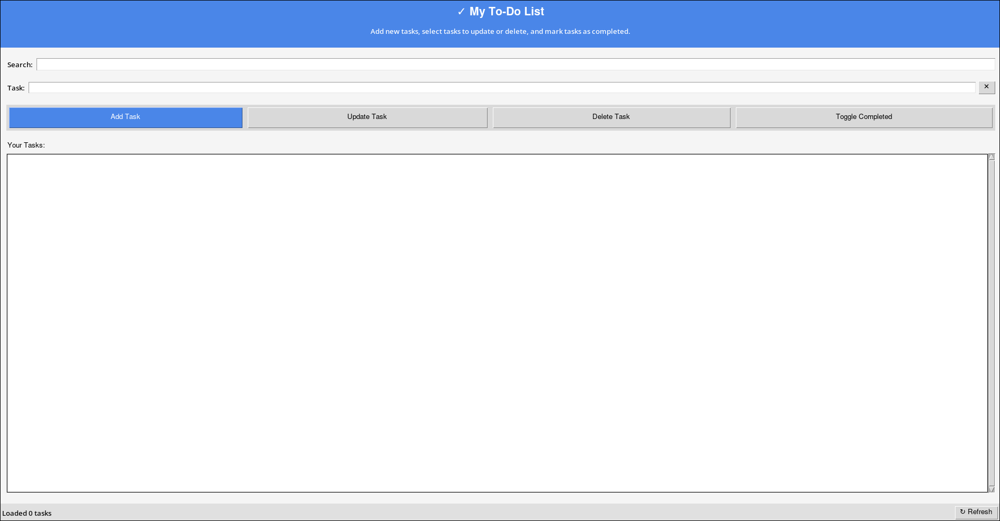
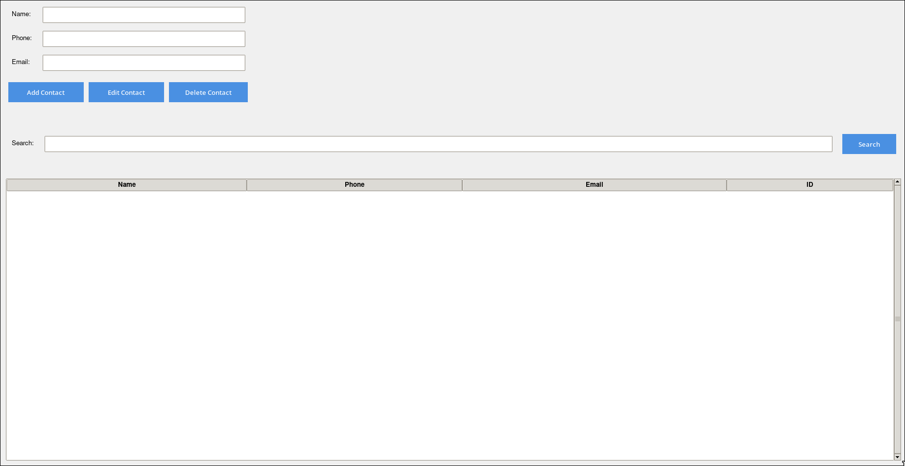
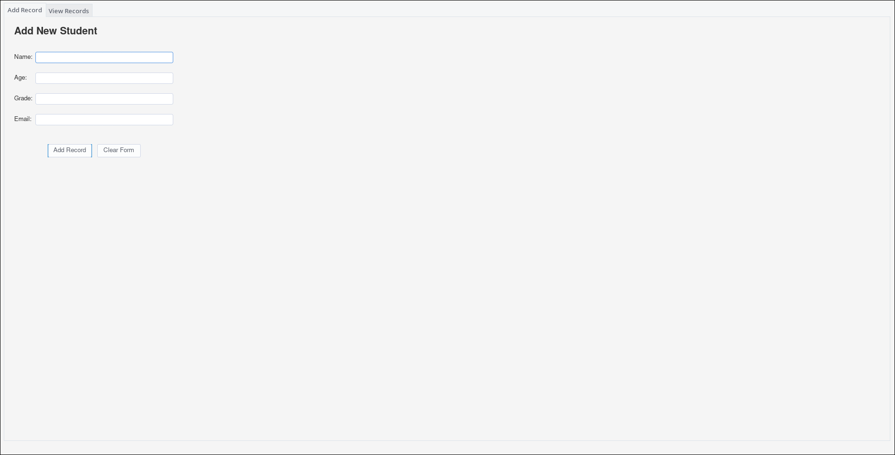
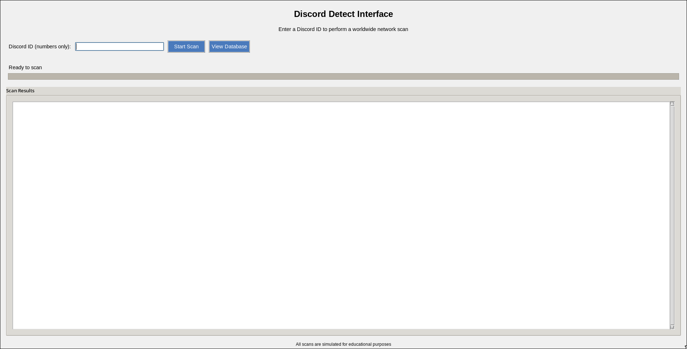

# Mini Project Python

## Overview
This mini project repository is designed for beginners and students who are learning Python programming. It demonstrates how to create simple applications using Tkinter for graphical user interfaces (GUIs) and SQLite for database management. Through these projects, users will gain hands-on experience with essential Python concepts, including:

- Event-driven programming
- GUI design with Tkinter
- Database interactions using SQLite
- Implementing CRUD (Create, Read, Update, Delete) operations
- Structuring and organizing Python projects

Each project in this repository provides practical examples to help learners understand how to integrate a database with a GUI application and develop small-scale applications that can be expanded with additional features.

## Projects

### **Project 1: To-Do List Application**
A simple task management application that allows users to keep track of their tasks.

#### Features:
- Add, update, and delete tasks
- Mark tasks as completed
- Store tasks in an SQLite database
- User-friendly GUI with Tkinter



🔗 **[View Code](project/1.py)**

---

### **Project 2: Simple Contact Book**
A contact management system to store and retrieve contact details efficiently.

#### Features:
- Add, edit, and delete contacts
- Search contacts by name
- Store names, phone numbers, and emails in an SQLite database
- User-friendly interface with Tkinter



🔗 **[View Code](project/2.py)**

---

### **Project 3: Student Record Management**
An application to manage student records, including their personal details and academic performance.

#### Features:
- Add, update, and delete student records
- Store details such as name, age, grade, and email in SQLite
- Display all records in a Tkinter table
- Simple and intuitive user interface



🔗 **[View Code](project/3.py)**

---

### **Project 4: Discord Tracker (Use at Your Own Risk)**
This project is currently under development.

#### Features:
- Functionality not yet specified



🔗 **[View Code](project/4.py)**

## How to Use
To run any of these projects on your local machine:

1. Clone this repository:
   ```bash
   git clone https://github.com/AxoGM/Example-Mini-Project-Python.git
   ```
2. Navigate to the project directory:
   ```bash
   cd Example-Mini-Project-Python/project
   ```
3. Run the desired project:
   ```bash
   python 1.py  # Replace with the corresponding project file
   ```

## Prerequisites
Ensure you have the following installed:
- Python 3.x
- Tkinter (comes pre-installed with Python)
- SQLite3 (comes pre-installed with Python)

## Contribution
Feel free to contribute to this project by submitting pull requests. You can also fork the repository and modify it to fit your own requirements. Contributions that improve functionality, UI design, or introduce new projects are welcome.

## License
This project is free to use and modify. However, proper attribution is appreciated. Use it for educational purposes and personal projects.

## Contact
If you need help understanding the project, consider using online resources such as Google or AI-based tools like ChatGPT. You can also seek assistance from experienced Python developers through forums and communities like Stack Overflow or GitHub Discussions.

> **Note:** This project is provided as-is. The author may not be available for extensive support.

